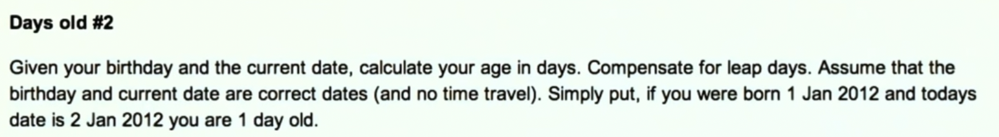
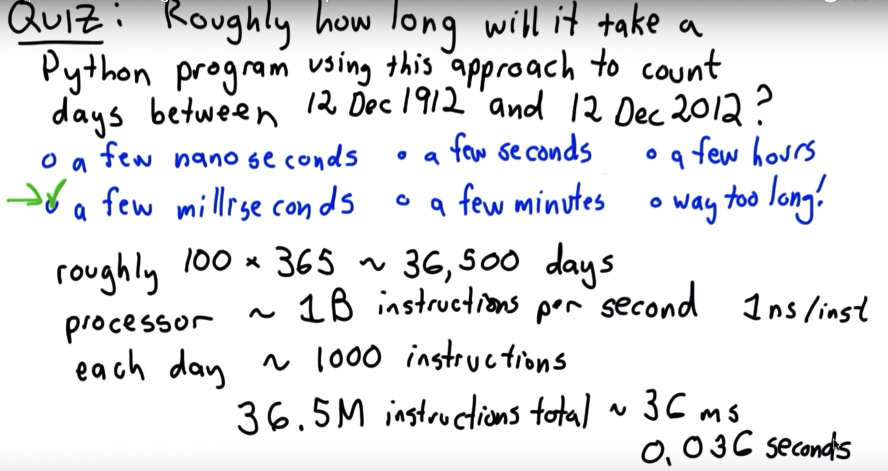

# How to solve a problem?

Avoid thinking about that particular problem, think in a general solution.



Steps:

### 1. Understand the (computation) problem.

Problem is defined by possible inputs, and the relationship of them with the desired outputs.

### 2. Recognize the inputs (What are the inputs?).
In the `daysBetweenDate.ipynb` file:

- Inputs: two dates.
- Inputs representation: `daysBetweenDates(year1, month1, day1, year2, month2, day2):`

What is the set of valid inputs?
- Second date must not be before first date (Use defensive programming).
- Gregorian calendar (15 Oct 1582).

### 3. What are the outputs?.

> "Given your birthday and the current date, calculate your age in days"

Meaning: return a number giving the number of days between the first date, and the second date.


### 4. Work through some examples by hand.

We can work out some examples (test cases) to check if our program is correct.

In this case, we can start looking at the calendar and check the number of days.

> Hard example: Leap years

Sample:
```
    daysBetweenDate(2013,1,24,2013,6,9):
    Jan 24 - Jan 31     =  7
    + Feb               =  28
    + March             =  31
    + April             =  30
    + May               =  31
    + June 1-29         =  29
                          ----
                           156     
    # days in years
    2013                = 365
    2014
    ...
    2024                = 366  (leap year)
```

* #### Algorithm "pseudocode".

```
    days = # of days in month1 - day1
    month1 += 1
    while month1 < month2:`
        days += # of days in month1
        month1 += 1
    days += day2
    while year1 < year2:
        days += days in year 1
```

* #### Should we implement this algorithm?.

No, we should find a simpler way, AND it doesn't address all cases

**doesn't handle:**

    1. Inputs dates in same month.
    2. month2 < month1 if year2 > year1-
    3. Counting days in leap year.

Let's think the simpler way:

### 5. Simple mechanical algorithm (different approach).
```
    days = 0
    while date1 is before date2:
        date1 = advance to next day
        days += 1
```



Maybe that is good enough.. looks pretty fast initially.

### 6. Don't optimize prematurely! Simple and correct.

What should we write first?

Still we want to break it down into simpler parts and make progress.

`nextDay(year,month,day) to get next day for a simple case.`


