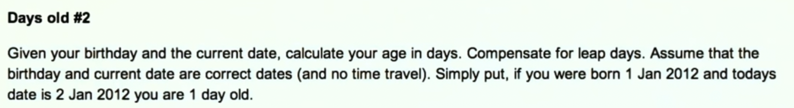

# How to solve a problem?

## 1. Understand the problem.
## 2. Recognize the inputs.

In the `daysBetweenDate.ipynb` file:

- Inputs: two dates.
- Inputs representation: `daysBetweenDates(year1, month1, day1, year2, month2, day2):`

What is the set of valid inputs?
- Second date must not be before first date (Defensive programming).
- Gregorian calendar (15 Oct 1582).

## 3. What are the outputs?
