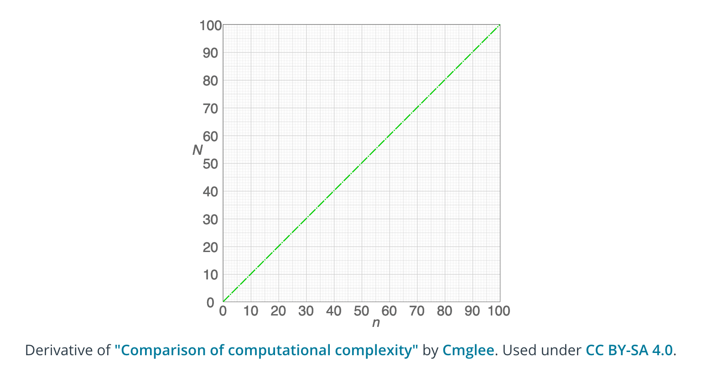
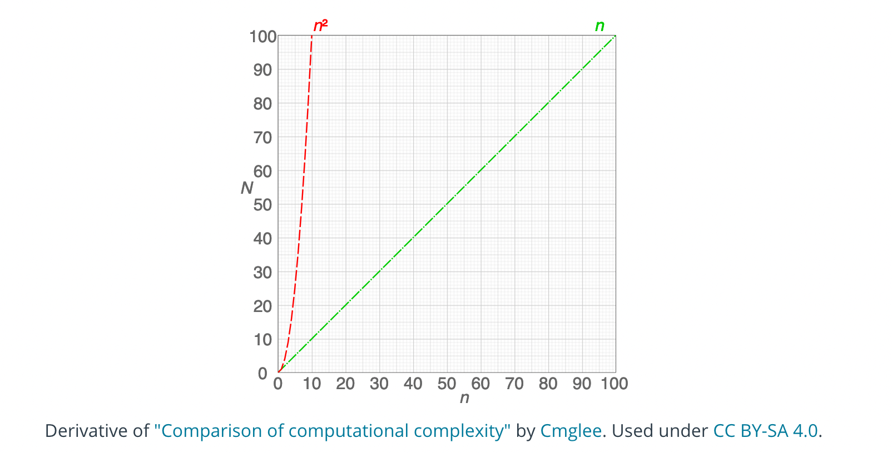
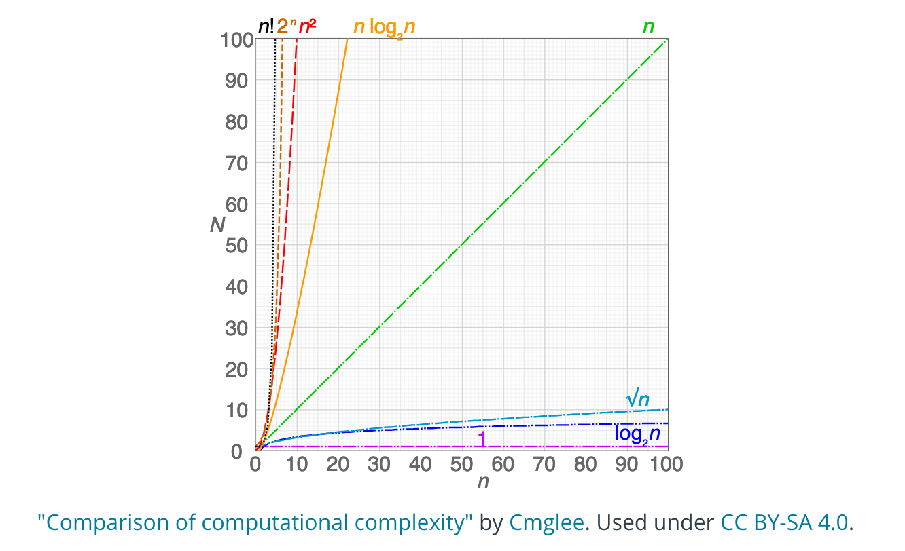

# Efficiency

We said earlier that this Nanodegree program is about how to write code to solve problems and to do so **efficiently.**
In the last section, we looked at some basic aspects of solving problems—, but we didn't really think too much about whether our solutions were efficient.

## Space and time

When we refer to the efficiency of a program, we aren't just thinking about its speed—we're considering both the **time**
it will take to run the program, and the amount of **space** the program will require in the computer's memory.
Often there will be a trade-off between the two, where you can design a program that runs faster by selecting a
data structure that takes up more space—or vice versa.

**Notes**

- Efficiency also called **complexity** is how well you're using your computer's resources
to get a particular job done.
- **Space and time**. How long does your code take to run, and how much storage space do you need?

## Algorithms

> An algorithm is essentially a series of steps for solving a problem. Usually,
> an algorithm takes some kind of input (such as an unsorted list) and then produces the desired output
> (such as a sorted list).

For any given problem, there are usually many different algorithms that will get you to exactly the same end result.
But some will be much more efficient than others. To be an effective problem solver, you'll need to develop the ability
to look at a problem and identify different algorithms that could be used—and then contrast those algorithms to consider
which will be more or less efficient. But computers are so fast!

Sometimes it seems like computers run programs so quickly that efficiency shouldn't really matter. And in some cases,
this is true—one version of a program may take 10 times longer than another, but they both still run so quickly that it
has no real impact.

But in other cases, a small difference in how your code is written—, or a tiny change in the type of data structure you
use—can mean the difference between a program that runs in a fraction of a millisecond, and a program that takes hours
(or even years!) to run.

### Quantifying efficiency

It's fine to say "this algorithm is more efficient than that algorithm", but can we be more specific than that?
Can we quantify things and say how much more efficient the algorithm is?

Let's look at a simple example, so that we have something specific to consider.

**Question 1 of 3**

Here is a short (and rather silly) function written in Python:

```python
def some_function(n):
    for i in range(2):
        n += 100
    return n
```

What does it do? Adds 200 to the given input.

**Question 2 of 3**

Now how about this one?

```python
def other_function(n):
    for i in range(100):
        n += 2
    return n
```

What does it do?  Adds 200 to the given input.

**Question 3 of 3**

So these functions have exactly the same end result. But can you guess which one is more efficient?

Here they are next to each other for comparison:

```python
def some_function(n):
    for i in range(2):
        n += 100
    return n

def other_function(n):
    for i in range(100):
        n += 2
    return n
```

* `some_function` is more efficient.

Although the two functions have the exact same end result, one of them iterates many times to get to that result,
while the other iterates only a couple of times.

This was admittedly a rather impractical example (you could skip the for loop altogether and just add 200 to the input),
but it nevertheless demonstrates one way in which efficiency can come up.


### Counting lines

With the above examples, what we basically did was count the number of lines of code that were executed.
Let's look again at the first function:

```python
def some_function(n):
    for i in range(2):
        n += 100
    return n
```

There are four lines in total, but the line inside the for a loop will get run twice.
So running this code will involve running 5 lines.

Now let's look at the second example:

```python
def other_function(n):
    for i in range(100):
        n += 2
    return n
```

In this case, the code inside the loop runs 100 times. So running this code will involve running 103 lines!

Counting lines of code is not a perfect way to quantify efficiency, and we'll see that there's a lot more to it as we
go through the program. But in this case, it's an easy way for us to approximate the difference in efficiency
between the two solutions. We can see that if Python has to perform an addition operation 100 times, this will certainly
take longer than if it only has to perform an addition operation twice!

### Input Size and Efficiency

**Question 1 of 6**

Here's one of our functions from the last page:

```python
def some_function(n):
    for i in range(2):
        n += 100
    return n
```

Suppose we call this function and give it the value 1, like this:

`some_function(1)`

And then we call it again, but give it the input 1000:

`some_function(1000)`

Will this change the number of lines of code that get run?

>No — the same number of lines will run in both cases.


**Question 2 of 6**

Now, here's a new function:

```python
def say_hello(n):
    for i in range(n):
        print("Hello!")
```

Suppose we call it like this:

`say_hello(3)`

And then we call it like this:

`say_hello(1000)`

Will this change the number of lines of code that get run?

> Yes — say_hello(1000) will involve running more lines of code.

This highlights a key idea:

> As the input to an algorithm increases, the time required to run the algorithm may also increase.

Notice that we said may increase. As we saw with the above examples,
input size sometimes affects the run-time of the program and sometimes doesn't—it depends on the program.

### The rate of increase

**Question 3 of 6**

Let's look again at this function from above:

```python
def say_hello(n):
    for i in range(n):
        print("Hello!")
```

Below are some different function calls. Match each one with the number of lines of code that will get run.

| Function call | How many lines get run? |
| ------------- |:-------------:|
| `say_hello(1)`    | 3 |
| `say_hello(2)`    | 4 |
| `say_hello(3)`    | 5 |
| `say_hello(4)`    | 6 |

**Question 4 of 6**

Here's another question about that same function (from the above exercise).
When we increase the size of the input n by 1, how many more lines of code get run?

> When n goes up by 1, the number of lines run also goes up by 1.

So here's one thing that we know about this function: As the input increases,
the number of lines executed also increases.

But we can go further than that! We can also say that as the input increases, the number of lines executed increases by
a proportional amount. Increasing the input by 1 will cause 1 more line to get run. Increasing the input by 10 will
cause 10 more lines to get run. Any change in the input is tied to a consistent, proportional change in the number of
lines executed. This type of relationship is called a linear relationship, and we can see why if we graph it:



- The horizontal axis, n, represents the size of the input (in this case, the number of times we want to print `"Hello!"`).
- The vertical axis, N, represents the number of operations that will be performed. In this case, we're thinking of an
  "operation" as a single line of Python code (which is not the most accurate, but it will do for now).

We can see that if we give the function a larger input, this will result in more operations.
And we can see the rate at which this increase happens—the rate of increase is linear. Another way of saying this is
that the number of operations increases at a constant rate.

If that doesn't quite seem clear yet, it may help to contrast it with an alternative possibility—a function where the
operations increase at a rate that is not constant.

**Question 5 of 6**

Now here's a slightly modified version of the say_hello function:

```python
def say_hello(n):
    for i in range(n):
        for i in range(n):
            print("Hello!")
```

Notice that it has a nested loop (a `for` loop inside another `for` loop!).

Below are some function calls. Match each one with the number of times `"Hello!" will get printed.

| Function call | How many times will it print hello? |
| ------------- |:-------------:|
| `say_hello(1)`    | 1 |
| `say_hello(2)`    | 4 |
| `say_hello(3)`    | 9 |
| `say_hello(4)`    | 16 |


**Question 6 of 6**

Looking at the `say_hello` function from the above exercise, what can we say about the relationship between the input,
n, and the number of times the function will print `"Hello!"`?

> The function will print `"Hello!"` **exactly n-squared times** (so `say_hello(2)` will print `"Hello!"`
> 2*2 or four times).

Notice that when the input goes up by a certain amount, the number of operations goes up by the square of that amount.
If the input is 2, the number of operations is 2^2 or 4. If the input is 3, the number of operations is
3^2 or 9.

To state this in general terms, if we have an input, nnn, then the number of operations will be n^2.
This is what we would call a **quadratic** rate of increase.

Let's compare that with the **linear** rate of increase. In that case, when the input is nnn,
the number of operations is also nnn.

Let's graph both of these rates, so we can see them together:



Our code with the nested `for` loop exhibits the quadratic n^2 relationship on the left. Notice that this results
in a much faster rate of increase. As we ask our code to print larger and larger numbers of `"Hellos!"`, the number of
operations the computer has to perform shoots up very quickly—much more quickly than our other function,
which shows a linear increase.

This brings us to a second key point. We can add it to what we said earlier:

> As the input to an algorithm increases, the time required to run the algorithm may also increase—**and different
> algorithms may increase at different rates.**

Notice that if **n** is very small, it doesn't really matter which function we use—but as we put in larger values
for **n**, the function with the nested loop will quickly become far less efficient.

We've looked here only at a couple of different rates—linear and quadratic. But there are many other possibilities.
Here we'll show some common types of rates that come up when designing algorithms:



We'll look at some of these other orders as we go through the class. But for now, notice how dramatic a difference
there is here between them! Hopefully you can now see that this idea of the order or rate of increase in the run-time
of an algorithm is an essential concept when designing algorithms.

### Order

We should note that when people refer to the rate of increase of an algorithm, they will sometimes instead use the
term order. Or to put that another way:

> The rate of increase of an algorithm is also referred to as the order of the algorithm.

For example, instead of saying "this relationship has a linear rate of increase", we could instead say,
"the order of this relationship is linear".

On the next page, we'll introduce something called Big O Notation, and you'll see that the "O" in the name refers
to the order of the rate of increase.

### Big O Notation (1/2)

When describing the efficiency of an algorithm, we could say something like "the run-time of the algorithm increases
linearly with the input size". This can get wordy, and it also lacks precision. So as an alternative,
mathematicians developed a form of notation called **big O notation**.

The "O" in the name refers to the order of the function or algorithm in question. And that makes sense, because
big O notation is used to describe the order—or rate of increase—in the run-time of an algorithm,
in terms of the input size (`n`).

In this next video, Brynn will show some different examples of what the notation would actually look like in practice.
This likely won't "click" for you right away, but don't worry—once you've gotten some experience applying it to real
problems, it will be much more concrete.

**Question 1 of 5**

When you see some Big O notation, such as O(2n + 2), what does `n` refer to?

> The length of the input to your algorithm.

**Question 2 of 5**

Here's the cipher pseudocode Brynn showed in the video:

```
function decode(input):
    create output string
    for each letter in input:
        get new_letter from letter's location in cipher
        add new_letter to output
    return output
```

Brynn estimated the efficiency as `O(2n + 2)`. Suppose the input string is `"jzqh"`. What is n in this case?

> 4


**Question 3 of 5**

Which of these is the same as `O(1)`?

> O(0n + 1)


**Question 4 of 5**

Here's one of the functions we looked at on the last page:

```python
def say_hello(n):
    for i in range(n):
        print("Hello!")
```

Which of these would best approximate the efficiency using big O notation?

> n

**Question 5 of 5**

Here's the other function we looked at on the last page:

```python
def say_hello(n):
    for i in range(n):
        for i in range(n):
            print("Hello!")
```

Again, which of these would best approximate the efficiency using big O notation?

> n^2


### Big O Notation (2/2)

In the examples we've looked at here, we've been approximating efficiency by counting the number of lines of code
that get executed. But when we are thinking about the run-time of a program, what we really care about is how fast the
computer's processor is, and how many operations we're asking the processor to perform. Different lines of code may
demand very different numbers of operations from the computer's processor. For now, counting lines will work OK as
an approximation, but as we go through the course you'll see that there's a lot more going on under the surface.


### Worst Case and Approximation

Suppose that we analyze an algorithm and decide that it has the following relationship between the input size, `n`,
and the number of operations needed to carry out the algorithm:

`N = n^2 + 5`

Where `n` is the input size and `N` is the number of operations required.

For example, if we gave this algorithm an input of `2`, the number of required operations would be `2^2 + 5`
or simply `9`.

**Quiz Question**

Below are some other possible values for the input (`n`). For each input, what does `n^2 + 5` evaluate to?

| Input | Number of operations |
| ----- |:--------------------:|
| 5     | 1 |
| 10    | 4 |
| 25    | 9 |
| 10    | 16 |

The thing to notice in the above exercise, is this: In `n^2 + 5`, the `5` has very little impact on the total
efficiency—especially as the input size gets larger and larger. Asking the computer to do 10,005 operations
vs. 10,000 operations makes little difference. Thus, it is the `n^2` that we really care about the most,
and the `+5` makes little difference.

Most of the time, when analyzing the efficiency of an algorithm, the most important thing to know is the _order_.
In other words, we care a lot whether the algorithm's time-complexity has a _linear_ order, or a _quadratic_ order
(or some other order). This means that very often (in fact, most of the time) when you are asked to analyze
an algorithm, you can do so by making an _approximation_ that significantly simplifies things. In this next video,
Brynn will discuss this concept and show how it's used with Big O Notation.

**Approximation**

- We normally use approximations when talking about efficiency in Big O notation.
